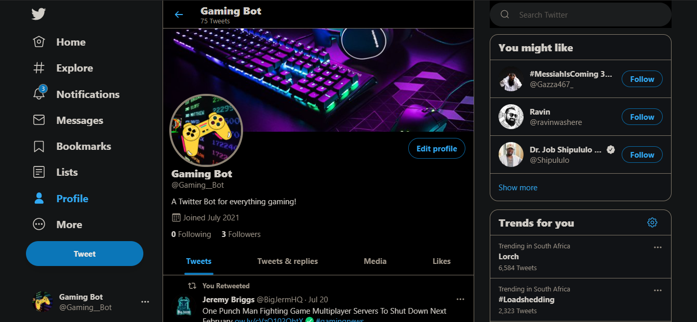

# Company-Site

In this project I created a twitter bot with the guidance of the
GirlCode Build a Twitter Bot Workshop presented by Refilwe Rametsi.

## Project Preview

[Twitter Bot Page](https://twitter.com/Gaming__Bot)

## Languages Used

- Python

## License

[MIT](https://choosealicense.com/licenses/mit/)

## Project Author

Santisha Reddy

- Github: [@SantishaR](https://github.com/SantishaR)

## Acknowledgments

- Refilwe Rametsi
